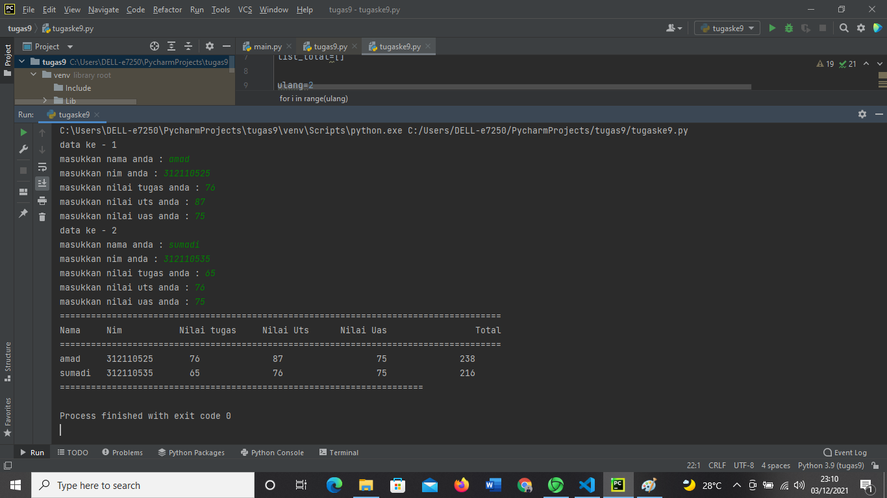
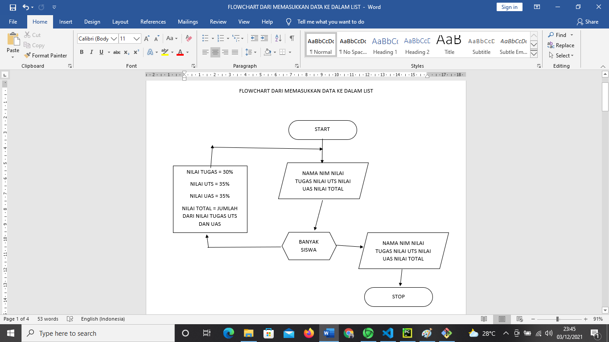

# tugaspemrograman9
## NAMA :AMAD SUMADI
### NIM : 312110525
#### KELAS : TI.21.CA1

##### langkah langkah memasukan data pada list
berikut ini adalah gambar dari langkah langkah memasukkan list

adapun hasil dari operasi tersebut akan menghasilkan seperti gambar di bawah ini
 
adapun flowchart dari prgram diatas 
